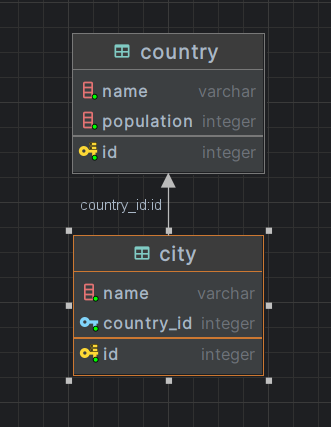

# Description

REST application displaying information about countries, their populations and cities.

The following technologies were used in the project::

* Spring Boot
* Spring Data JPA
* PostgreSQL
* Swagger

Swagger documentation: http://localhost:8080/swagger-ui/index.html

# Getting Started

To start the project, you need to connect to a local database, and also specify the connection parameters in the file `application.yml`.

ER-model database:

